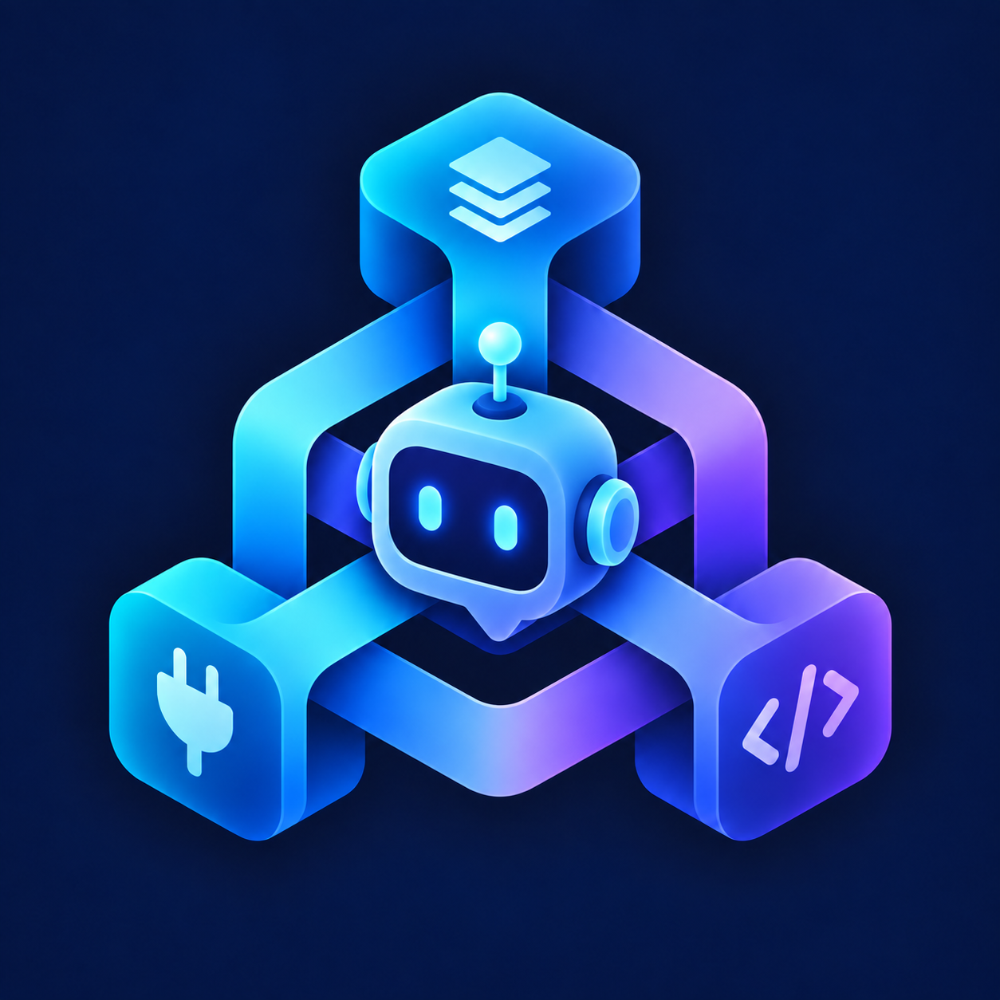

# BotWeave

> A modular Java library for building bots across platforms



**BotWeave** is a lightweight, extensible Java library for developing bots across different platforms and protocols. It provides a common API for capabilities, conversations, events, users and so on. And platform-specific implementations are provided through independent Connectors.

BotWeave is currently under active development and its API may change.

## Features

- **Platform-independent API**: Application logic works with common BotWeave abstractions instead of protocol-specific objects.
- **Capability-based design**: Bot features such as messaging, group moderation and queries are exposed as independent capabilities.
- **Unified model**: Incoming platform events are converted into common BotWeave events and delivered through the event bus. Text, images, mentions, and other message elements share a common representation.
- **Asynchronous operations**: Network-related operations use `CompletionStage` instead of blocking the caller.
- **Pluggable connectors**: Platform and protocol support can be implemented separately without polluting the core API.

## Usage

### Requirements

- Java 8 or later

### Installation

The examples below use `botweave-connector`, which brings in all official connectors as transitive dependencies. To use only one connector, replace `botweave-connector` with its artifact name, such as `botweave-connector-qq-ob11`.

#### Maven

```xml
<dependency>
    <groupId>org.vaelow233.botweave</groupId>
    <artifactId>botweave-connector</artifactId>
    <version>1.0.0</version>
</dependency>
```

#### Gradle (Groovy DSL)

```groovy
dependencies {
    implementation 'org.vaelow233.botweave:botweave-connector:1.0.0'
}
```

#### Gradle (Kotlin DSL)

```kotlin
dependencies {
    implementation("org.vaelow233.botweave:botweave-connector:1.0.0")
}
```

The following example connects to a OneBot 11 WebSocket server at `ws://127.0.0.1:3001`. The bot replies with pong when it receives a text element containing exactly ping, ignoring leading and trailing whitespace.

```java
public class Example {
    public static void main(String[] args) throws IOException {
        // Create the BotWeave instance
        try (BotWeave weave = new BotWeave()) {
            // Subscribe to MessageReceivedEvent
            weave.events().subscribe(MessageReceivedEvent.class, event -> {
                // Get all the message elements
                List<MessageElement> elements = event.message().content().elements();
                // Check whether any text element equals "ping" after trimming whitespace.
                boolean ping = elements.stream().anyMatch(element -> 
                        element instanceof TextElement && "ping".equals(((TextElement) element).text().trim()));

                if (!ping) {
                    return;
                }

                // Check whether the bot supports messaging
                event.bot().capability(Messaging.class)
                        .ifPresent(messaging -> messaging.send(event.message().conversation(), MessageContent.of(new TextElement("pong"))) // Send a "pong" to the original conversation
                                        .whenComplete((sent, error) -> {
                                            if (error != null) {
                                                error.printStackTrace();
                                            } else {
                                                System.out.println("Successfully sent the message " + sent.id().value());
                                            }
                                        })
                        );
            });

            // Configure the connection
            OneBotConfig config = new OneBotConfig("ws", "127.0.0.1", 3001, "ThisIsMyToken!");

            // Start the connector with the configuration
            weave.connectors()
                    .start("qq-main", new OneBotConnectorFactory(), config)
                    .toCompletableFuture()
                    .join();

            System.out.println("Connector initialized, press Enter to quit.");
            System.in.read();
        }
    }
}
```

Before running the example, start a OneBot 11 forward WebSocket server, configure its message format as array, and replace the example token with the server's token.

## Build

BotWeave uses Gradle to build the project:

```shell
./gradlew clean build
```

## License

BotWeave is released under the [LGPL-3.0 license](LICENSE).
